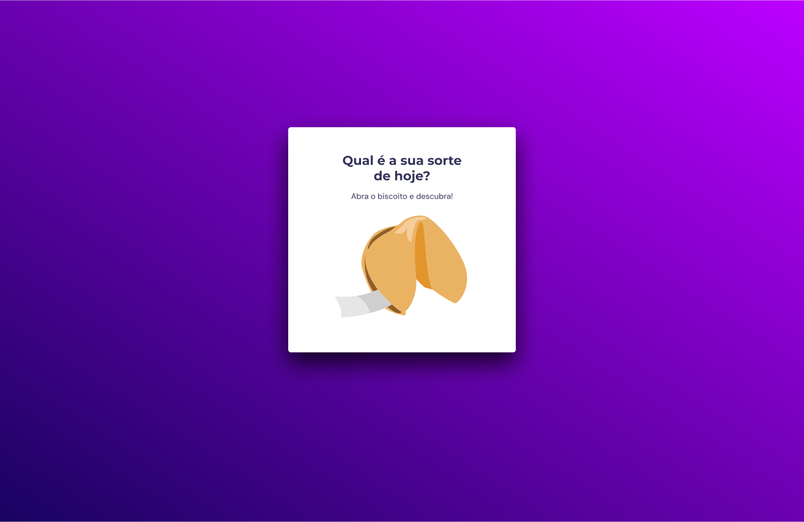

# Biscoito da Sorte
Jogo em que o usuário abre um biscoito com a sua sorte do dia.  
Feito pro curso Explorer da Rocketseat.  
Conteúdos usados/revisados:  
- Estrutura de dados HTML  
- Animações com CSS  
- Funções no Javascript  
- Manipulação da DOM  
- Biblioteca JS Math()  
- Funções callback  
- Arrays

## Tecnologias
- HTML  
- CSS  
- JavaScript  
- Git

### Layout
Projeto feito a partir [desse](<https://www.figma.com/file/CzWwOLQ3cFhlXH980in57G/Biscoito-da-Sorte-(Community)?type=design&node-id=0-1&mode=design>) layout do Figma.
 
